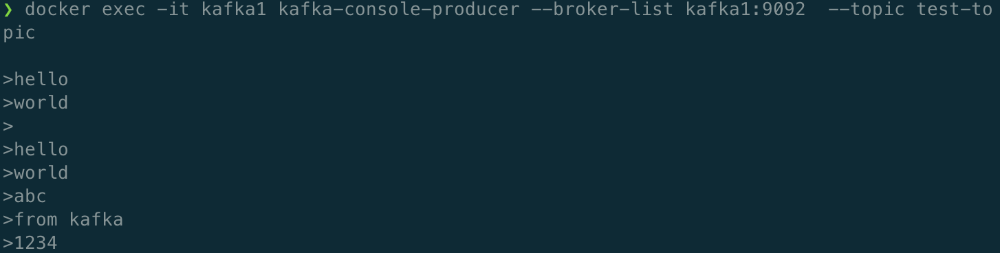
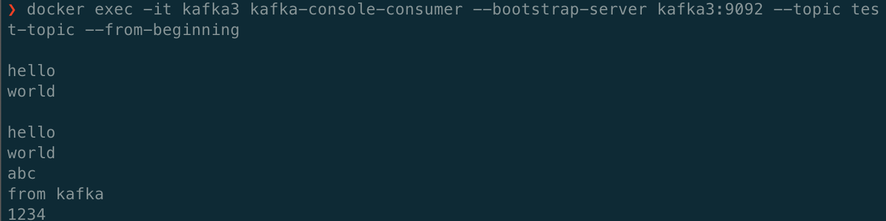
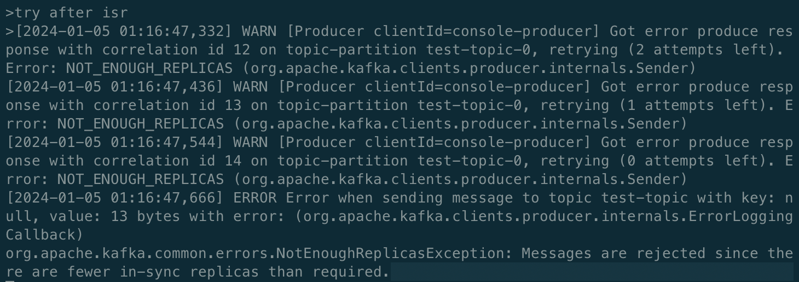

### Kafka 實作：`in-sync-replicas (ISR)`

題目：

請試著run 3個broker, 設置min.insync.replicas=2，並且驗證in-sync broker 數量少於min.insync.replicas時會發生什麼事情？請以截圖搭配說明並作成 pdf 上傳
實驗：


`ISR` 的作用：
ISR 指的是需要跟 partition leader 保持同步的 replica 數量，舉例來說，如果我們這裡有 3 個 broker,
那在 partition leader (kafka1) 發送消息，則 kafka1 需要把消息 replicate 到 kafka2, kafka3 才會回覆 client 發送成功。

準備環境：

`docker-compose.yml`: (設定KAFKA_MIN_INSYNC_REPLICAS: 2)

```
x-common-env: &common-env
      KAFKA_ZOOKEEPER_CONNECT: zookeeper:2181
      KAFKA_LISTENER_SECURITY_PROTOCOL_MAP: EXTERNAL:PLAINTEXT,INTERNAL:PLAINTEXT
      KAFKA_INTER_BROKER_LISTENER_NAME: INTERNAL
      KAFKA_MIN_INSYNC_REPLICAS: 2

version: '3'
services:
  zookeeper:
    image: confluentinc/cp-zookeeper:7.2.1
    container_name: zookeeper
    environment:
      ZOOKEEPER_CLIENT_PORT: 2181
  kafka1:
    image: confluentinc/cp-kafka:7.2.1
    container_name: kafka1
    ports:
      - "8097:8097"
    depends_on:
      - zookeeper
    environment:
      KAFKA_BROKER_ID: 1
      KAFKA_ADVERTISED_LISTENERS: EXTERNAL://localhost:8097,INTERNAL://kafka1:9092
      <<: *common-env
  kafka2:
    image: confluentinc/cp-kafka:7.2.1
    container_name: kafka2
    ports:
      - "8098:8098"
    depends_on:
      - zookeeper
    environment:
      KAFKA_BROKER_ID: 2
      KAFKA_ADVERTISED_LISTENERS: EXTERNAL://localhost:8098,INTERNAL://kafka2:9092
      <<: *common-env
  kafka3:
    image: confluentinc/cp-kafka:7.2.1
    container_name: kafka3
    ports:
      - "8099:8099"
    depends_on:
      - zookeeper
    environment:
      KAFKA_BROKER_ID: 3
      KAFKA_ADVERTISED_LISTENERS: EXTERNAL://localhost:8099,INTERNAL://kafka3:9092
      <<: *common-env
```

創建 topic:

```shell
$ docker exec -it kafka1 kafka-topics --create --topic test-topic --partitions 1 --replication-factor 2 --if-not-exists --bootstrap-server kafka1:9092
```
在 `kafka1` 使用 `console-producer` 發送消息:

```shell
$ docker exec -it kafka1 kafka-console-producer --broker-list kafka1:9092  --topic test-topic
```


發現可以正常傳送。

在 `kafka3` 使用 `console-consumer` 接收消息，發現可以正常接收


在關掉 `kafka2` 後，使用 console-producer 發送消息 `try after isr`，會產生 `NOT_ENOUGH_REPLICAS` 錯誤



Ref: [Kafka Topic Configuration: Minimum In-Sync Replicas](https://www.conduktor.io/kafka/kafka-topic-configuration-min-insync-replicas/)