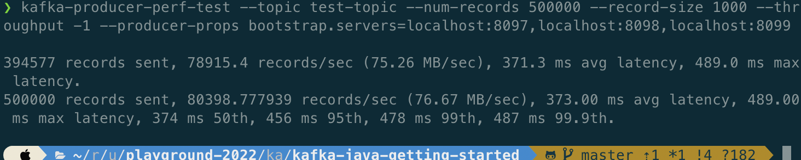
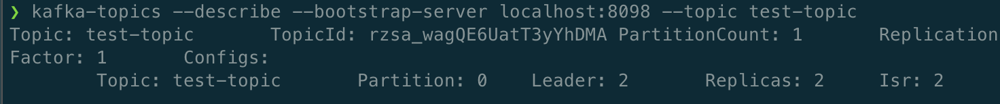
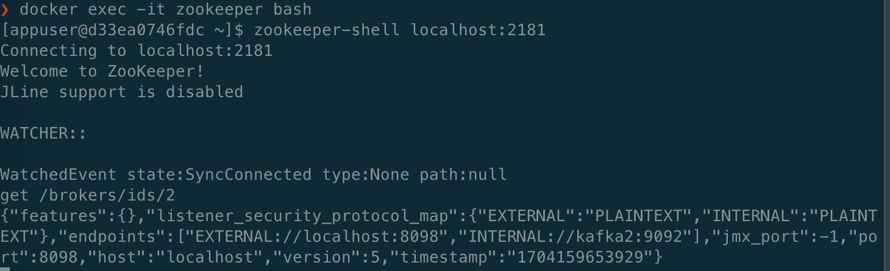
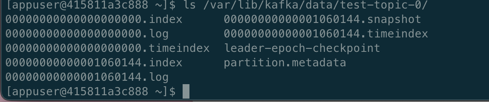
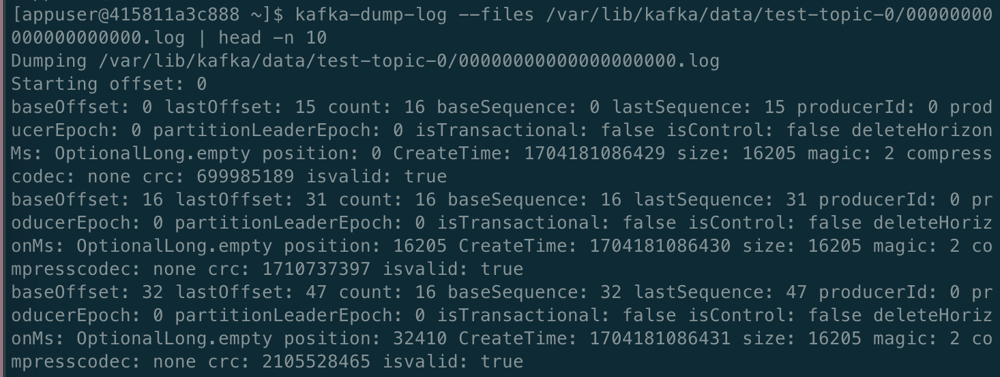

### `kafka-perf-test`

請試著佈署一個kafka cluster，並用kafka-producer-perf-test script送資料給一個topic，試著讓一個topic partition的資料夾內的log segment (xxx.log) 出現至少2個，並用kafka-dump-log script看最前面三筆資料。請以截圖搭配說明並作成 pdf 上傳

#### 重現步驟：
使用以下配置起一個 3 個 broker 的 zookeeper mode kafka cluster

```
version: '3'
services:
  zookeeper:
    image: confluentinc/cp-zookeeper:7.2.1
    container_name: zookeeper
    environment:
      ZOOKEEPER_CLIENT_PORT: 2181
  kafka1:
    image: confluentinc/cp-kafka:7.2.1
    container_name: kafka1
    ports:
      - "8097:8097"
    depends_on:
      - zookeeper
    environment:
      KAFKA_BROKER_ID: 1
      KAFKA_ZOOKEEPER_CONNECT: zookeeper:2181
      KAFKA_LISTENER_SECURITY_PROTOCOL_MAP: EXTERNAL:PLAINTEXT,INTERNAL:PLAINTEXT
      KAFKA_ADVERTISED_LISTENERS: EXTERNAL://localhost:8097,INTERNAL://kafka1:9092
      KAFKA_INTER_BROKER_LISTENER_NAME: INTERNAL
  kafka2:
    image: confluentinc/cp-kafka:7.2.1
    container_name: kafka2
    ports:
      - "8098:8098"
    depends_on:
      - zookeeper
    environment:
      KAFKA_BROKER_ID: 2
      KAFKA_ZOOKEEPER_CONNECT: zookeeper:2181
      KAFKA_LISTENER_SECURITY_PROTOCOL_MAP: EXTERNAL:PLAINTEXT,INTERNAL:PLAINTEXT
      KAFKA_ADVERTISED_LISTENERS: EXTERNAL://localhost:8098,INTERNAL://kafka2:9092
      KAFKA_INTER_BROKER_LISTENER_NAME: INTERNAL
  kafka3:
    image: confluentinc/cp-kafka:7.2.1
    container_name: kafka3
    ports:
      - "8099:8099"
    depends_on:
      - zookeeper
    environment:
      KAFKA_BROKER_ID: 3
      KAFKA_ZOOKEEPER_CONNECT: zookeeper:2181
      KAFKA_LISTENER_SECURITY_PROTOCOL_MAP: EXTERNAL:PLAINTEXT,INTERNAL:PLAINTEXT
      KAFKA_ADVERTISED_LISTENERS: EXTERNAL://localhost:8099,INTERNAL://kafka3:9092
      KAFKA_INTER_BROKER_LISTENER_NAME: INTERNAL
```


使用 `kafka-producer-perf-test` 製造 500000 個 record


使用 kafka-topic 工具找到 partition leader 為 ID = 2 的 broker


進到 zookeeper 使用 `zookeeper-shell` 工具
執行 `get /brokers/ids/2` 找到這個 ID=2 的 broker 所在的 ip
`localhost:8098`, 為 `kafka2`


使用 docker exec 進到 broker `kafka2` 的 test-topic dir, 看到有兩個以上 `xxx.log`


看最前面那個 log 的前三筆資料 (baseOffset: 0, 16, 32)
