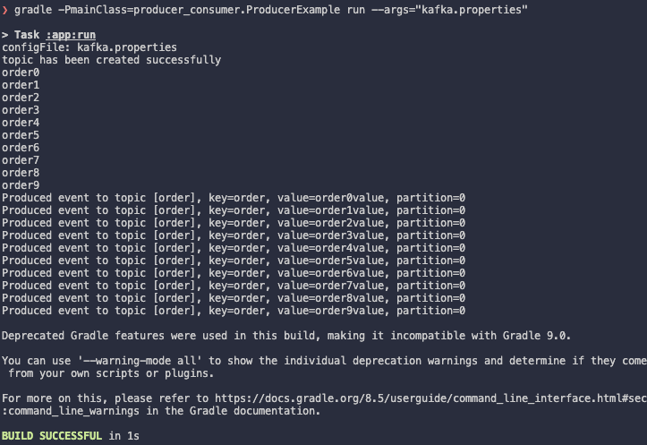
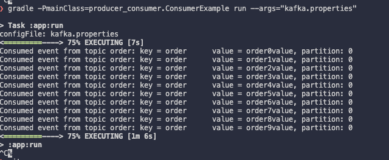

### Producer-Consumer-With-Order

請試著佈署一個kafka cluster，並完成下列步驟：
1. 建立一個具有 10 個 partitions 的 topic
2. 使用官方 Java Producer APIs 撰寫一隻程式傳遞 10 筆資料給上述 topic
3. 使用官方 Java Consumer APIs 撰寫一隻程式從上述 topic 收取該10筆資料
4. 請試著讓步驟2 和 步驟 3 的資料順序一致。例如 producer 傳送的資料順序為 a,b,c,d，consumer 收到的資料應該為 a,b,c,d 

使用 Java API 建立一個擁有 10 個 partition 的 topic `order`，
然後建立 `ProducerExample` class，建立 `KeyPartitioner` 的 class, 他會實作 `Partitioner` 這個 interface，把 message 都透過 key 來做區分，
這樣在 10 筆資料都使用同個 key 的情況下，就能把他們分到同個 partition, 並維持 prodcer 傳送的資料順序。

`ProducerExample.java`:

```java
package producer_consumer;

import java.nio.file.*;
import java.io.*;
import java.util.*;
import org.apache.kafka.clients.admin.*;
import org.apache.kafka.clients.producer.*;

public class ProducerExample {
    public static void main(String[] args) throws IOException {
        if (args.length != 1) {
            System.out.println("Please provide the configuration file path as a command line argument");
            System.exit(1);
        }

        Properties props = loadConfig(args[0]);
        props.put("partitioner.class",
                "producer_consumer.KeyPartitioner");
        String topic = "order";
        int numPartitions = 10;
        createTopicIfNotExists(props, topic, numPartitions, 2);

        String[] orders = {
                "order0",
                "order1",
                "order2",
                "order3",
                "order4",
                "order5",
                "order6",
                "order7",
                "order8",
                "order9",
        };

        try (final Producer<String, String> producer = new KafkaProducer<>(props)) {
            for (String order : orders) {
                String key = "order";
                String value = order + "value";
                producer.send(
                        // send these records to the same partition
                        new ProducerRecord<String, String>(topic, key, order + "value"),
                        (event, ex) -> {
                            if (ex != null)
                                ex.printStackTrace();
                            else
                                System.out.printf("Produced event to topic [%s], key=%s, value=%s, partition=%d\n",
                                        topic, key,
                                        value, event.partition());
                        });
                System.out.println(order);
            }
        }
    }

    private static void createTopicIfNotExists(Properties props, String topic, int numPartitions, int repFactor) {
        try (AdminClient adminClient = AdminClient.create(props)) {
            // Check if the topic already exists
            ListTopicsResult topicsResult = adminClient.listTopics();
            Set<String> existingTopics = topicsResult.names().get();
            if (existingTopics.contains(topic)) {
                System.out.println("Topic already exists: " + topic);
            } else {
                // Create the topic with 10 partitions
                NewTopic newTopic = new NewTopic(topic, numPartitions, (short) repFactor);
                CreateTopicsResult createTopicsResult = adminClient.createTopics(Collections.singletonList(newTopic));
                createTopicsResult.all().get();
                System.out.println("topic has been created successfully");
            }
        } catch (Exception e) {
            e.printStackTrace();
        }
    }

    public static Properties loadConfig(final String configFile) throws IOException {
        System.out.println("configFile: " + configFile);
        if (!Files.exists(Paths.get(configFile))) {
            throw new IOException(configFile + " not found.");
        }
        final Properties cfg = new Properties();
        try (InputStream inputStream = new FileInputStream(configFile)) {
            cfg.load(inputStream);
        }
        return cfg;
    }
}
```

`KeyPartitioner.java`:

```java
// https://redpanda.com/guides/kafka-tutorial/kafka-partition-strategy

package producer_consumer;

import org.apache.kafka.clients.producer.Partitioner;
import org.apache.kafka.common.Cluster;
import org.apache.kafka.common.PartitionInfo;
import org.apache.kafka.common.InvalidRecordException;
import java.util.Map;
import java.util.List;

public class KeyPartitioner implements Partitioner {
    public void configure(Map<String, ?> configs) {
    }

    public int partition(String topic, Object key, byte[] keyBytes,
            Object value, byte[] valueBytes, Cluster cluster) {
        List<PartitionInfo> partitions = cluster.partitionsForTopic(topic);
        int numPartitions = partitions.size();
        if ((keyBytes == null) || (!(key instanceof String)))
            throw new InvalidRecordException("Record must have a valid string key");
        return Math.abs(key.hashCode() % numPartitions);
    }

    public void close() {
    }

}
```

`ConsumerExample.java`:

```java
package producer_consumer;
import java.time.Duration;
import java.util.Arrays;
import java.util.Properties;

import org.apache.kafka.clients.consumer.*;

public class ConsumerExample {

    public static void main(final String[] args) throws Exception {
        if (args.length != 1) {
            System.out.println("Please provide the configuration file path as a command line argument");
            System.exit(1);
        }

        final String topic = "order";

        // Load consumer configuration settings from a local file
        // Reusing the loadConfig method from the ProducerExample class
        final Properties props = ProducerExample.loadConfig(args[0]);

        // Add additional properties.
        props.put(ConsumerConfig.GROUP_ID_CONFIG, "order_example");
        props.put(ConsumerConfig.AUTO_OFFSET_RESET_CONFIG, "earliest");
        // StickyAssignor sticky = new StickyAssignor();
        // props.put(ConsumerConfig.PARTITION_ASSIGNMENT_STRATEGY_CONFIG,
        // sticky.name());
        try (final Consumer<String, String> consumer = new KafkaConsumer<>(props)) {
            consumer.subscribe(Arrays.asList(topic));
            while (true) {
                ConsumerRecords<String, String> records = consumer.poll(Duration.ofMillis(100));
                for (ConsumerRecord<String, String> record : records) {
                    String key = record.key();
                    String value = record.value();
                    System.out.println(
                            String.format("Consumed event from topic %s: key = %-10s value = %s, partition: %d", topic,
                                    key, value,
                                    record.partition()));
                }
            }
        }
    }
}
```

Console output:

Producer:

Consumer: 
